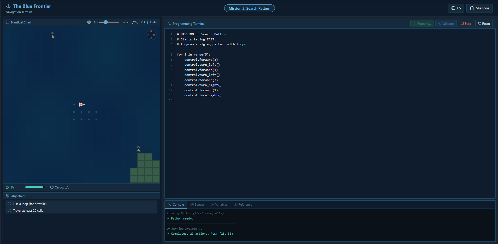
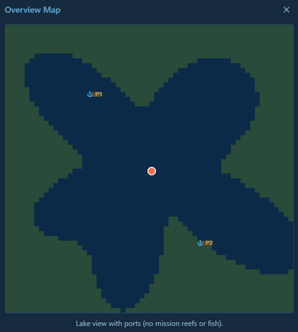

# La Frontera Azul

A web-based game engine for teaching programming fundamentals. Students write Python code to control a boat navigating a procedurally generated lake with obstacles, fish, and ports.



## Overview

Students progress through 7 missions of increasing complexity, learning:

1. **Sequential execution** — move the boat forward
2. **Turning & composition** — combine movements into routes
3. **Loops** — cover area with search patterns
4. **Conditionals & sensors** — react to obstacles in real time
5. **Variables & coordinates** — navigate to a target using math
6. **Algorithms in fog** — Bug-0 wall-following with limited visibility
7. **Functions & autonomy** — collect resources and return to port

Python code runs in the browser via [Pyodide](https://pyodide.org/) (CPython compiled to WebAssembly). No server required.

## Features

- **Real Python execution** — full CPython in the browser, not a toy subset
- **Boat-centric viewport** — the world scrolls around the boat, keeping it centered
- **Progressive mission system** — each mission unlocks the next, with starter code and hints
- **Sensor system** — `sensor.scan()` returns a 5×5 matrix relative to the boat's heading
- **Fog of war** — later missions hide the map, forcing use of sensors
- **Multi-run validation** — randomized missions are validated over multiple runs to ensure robust solutions
- **Animated execution** — watch the boat move step by step, with adjustable speed
- **Built-in reference panel** — API docs always visible while coding
- **Bilingual** — full Spanish and English support (i18n)

## Student API

Students interact with the boat through three namespaces:

```python
# Movement
control.forward(n)      # Move n cells in current heading
control.turn_right()    # Rotate 90° starboard
control.turn_left()     # Rotate 90° port
control.collect()       # Pick up cargo at current position

# Sensors
sensor.forward()        # What's in the cell ahead ("water", "reef", "land", "port", "fish")
sensor.scan()           # 5×5 matrix relative to heading

# Navigation
nav.x(), nav.y()        # Current position
nav.heading_num()       # 0=North, 1=East, 2=South, 3=West
nav.fuel()              # Remaining fuel
nav.cargo()             # Current cargo count
nav.port_x(id)          # Port coordinates
nav.port_y(id)
nav.port_distance(id)   # Manhattan distance to port
nav.nearest_port()      # ID of closest port
```

## Tech Stack

| Layer          | Technology                           |
| -------------- | ------------------------------------ |
| UI             | React 19, TypeScript, Tailwind CSS 4 |
| Build          | Vite                                 |
| Python runtime | Pyodide 0.26 (CPython → WebAssembly) |
| Icons          | Lucide React                         |
| Tests          | Vitest + tsx                         |

## Getting Started

```bash
# Install dependencies
pnpm install

# Start dev server
pnpm dev

# Run tests
pnpm test
```

The dev server starts at `http://localhost:5173`. Pyodide is loaded from CDN on first run (~10s initial load).

## Project Structure

```
src/
├── main.tsx                # Entry point
├── App.tsx                 # Main app state & orchestration
├── game.ts                 # Game world: map generation, rendering, boat state
├── python-executor.ts      # Pyodide bridge: runs student code, exposes API
├── missions.ts             # Mission definitions (objectives, starter code, params)
├── events.ts               # Event bus for decoupled communication
├── i18n.tsx                # Internationalization (es/en)
├── index.css               # Global styles
└── components/
    ├── Header.tsx          # Top bar with mission selector
    ├── WorldPanel.tsx      # Canvas viewport, fuel/cargo gauges, objectives
    ├── EditorPanel.tsx     # Code editor, console, sensor view, reference
    ├── MissionModal.tsx    # Mission briefing dialog
    ├── MissionsSidebar.tsx # Mission list with progress
    └── SuccessModal.tsx    # Completion celebration
tests/
├── game.test.ts            # Game logic unit tests
└── executor.test.mts       # Python executor integration tests
```

## Game World

The world is a 60×60 grid lake with a procedurally generated irregular coastline. Two fixed ports (North and South) serve as navigation targets. Reefs and fish are placed randomly per mission configuration.



The viewport shows a 21×21 window centered on the boat. In fog missions, only cells within sensor range are revealed.

## Adding Missions

Missions are defined in `src/missions.ts`. Each mission specifies:

```typescript
{
  id: number,
  startPos: { x, y },        // Boat starting position
  startDir: number,          // Initial heading (0-3)
  fuel: number,              // Fuel budget
  fog: boolean,              // Enable fog of war
  randomReefs: number,       // Random reef count
  randomFish: number,        // Random fish count
  fixedReefs?: { x, y }[],   // Deterministic reef positions
  objectives: Objective[],   // Win conditions
  starterCode: string,       // Pre-filled editor code
  unlocks: number[],         // Mission IDs unlocked on completion
}
```

Objectives can check boat state, code patterns, or world conditions.

## Planned Development

### More Maps & Missions

Additional lake maps with different shapes, currents, and shallow zones. Expanded mission progression covering more advanced algorithms (A\* pathfinding, BFS grid search, dynamic programming).

### Data Science & AI

Sonar readings return rich fish data such as estimated shape, size, depth, and echo signature. Students write classifiers to decide whether to harvest or release each fish based on species identification. Teaches feature extraction, decision trees, and basic ML concepts without leaving the Python environment.

### Image & Audio Processing

Underwater survey missions where the boat deploys a probe that returns pixel grids (depth maps) or waveform arrays (sonar pings). Students process these with numpy/scipy to reconstruct terrain profiles, detect anomalies, or locate sunken objects. Introduces signal processing and array manipulation in a concrete context.

### Inventory, Multiple Boats & Commerce Routes

Expand the economy layer: manage a fleet of boats with different cargo capacities, fuel costs, and speed profiles. Plan optimized trade routes between ports with fluctuating supply and demand. Teaches optimization, graph algorithms, and resource scheduling.

### Web Hosting & OAuth2 Progress Saving

Deploy to a public URL with persistent accounts. Students log in via OAuth2 (GitHub, Google) to save mission completion, code history, and unlocked content across devices. Backend stores progress server-side so nothing is lost when clearing browser storage.

## License

MIT
